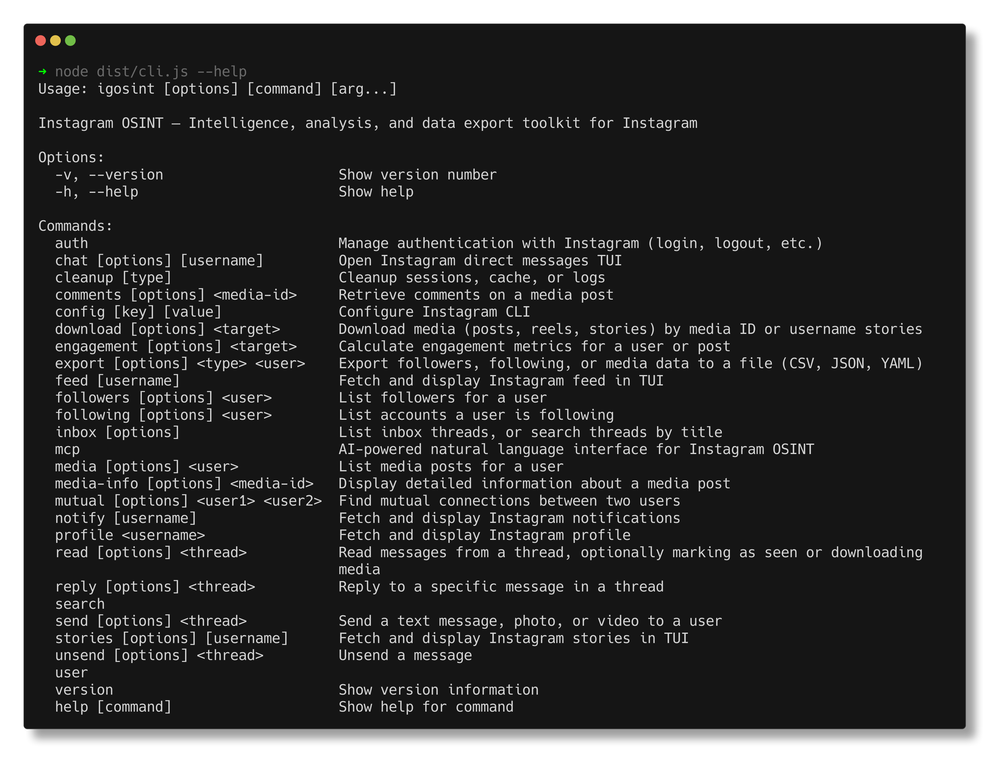
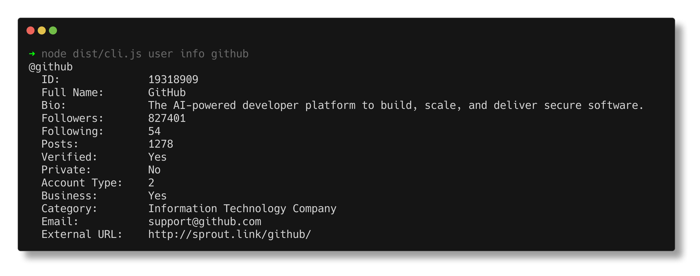
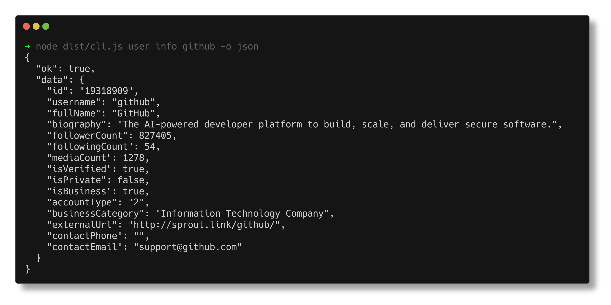
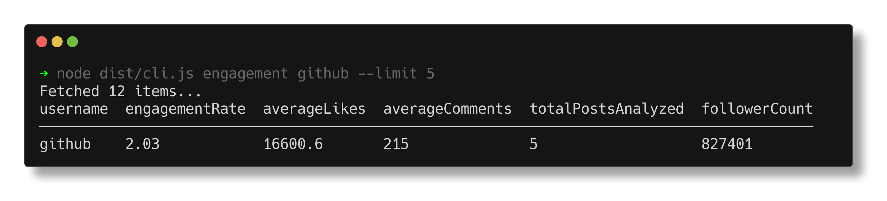
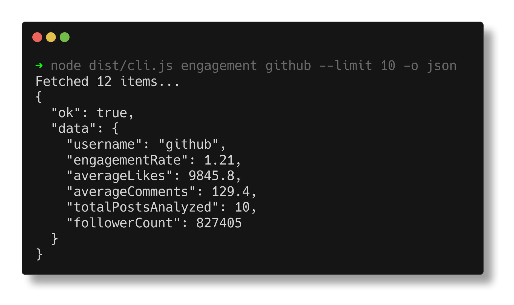
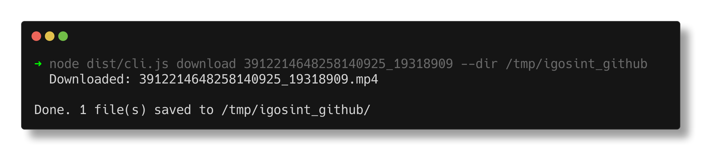

<p align="center">
  <h1 align="center">🔍 Instagram OSINT</h1>
  <p align="center">
    Intelligence, analysis, and data export toolkit for Instagram.<br/>
    Powered by AI. Built for the terminal.
  </p>
</p>

<p align="center">
  
  
  
  
  
</p>

<p align="center">
  
</p>

<p align="center">
  
</p>

---

## What is this?

**Instagram OSINT** (`igosint`) is a terminal toolkit for Instagram intelligence gathering and analysis. It connects to Instagram through an authenticated session and exposes 25+ commands for profiling accounts, mapping social graphs, calculating engagement, downloading media, exporting bulk data, and running complex investigations through natural language AI.

Two modes of operation:

| Mode | How | Best for |
|------|-----|----------|
| **CLI Mode** | Direct commands (`igosint followers github --limit 10`) | Scripts, automation, specific queries |
| **AI Chat Mode** | Talk to it like a human: *"download all photos of @target to ~/Desktop/investigation and export their follower list as CSV"* | Complex multi-step OSINT workflows, hands-free intelligence gathering |

> **AI Chat Mode** turns Instagram OSINT into an autonomous agent. You describe what you want in plain language. The AI interprets your intent, decides which tools to call (sometimes 5+ in sequence), handles file paths, output formats, and directory creation automatically. No memorizing commands. No reading docs. Just ask.

---

## Quick Start

```bash
git clone https://github.com/usualdork/InstagramOSINT.git
cd igosint && npm install && npm run build

# Login to Instagram
npx igosint auth login

# Start using
npx igosint user info github
npx igosint mcp setup     # Configure AI
npx igosint mcp chat      # Ask anything
```

---

## Features at a Glance

| Category         | Commands                           | What it does                                          |
| ---------------- | ---------------------------------- | ----------------------------------------------------- |
| **Profile**      | `user info`                        | Full profile data, business info, contact details     |
| **Social Graph** | `followers`, `following`, `mutual` | Follower/following lists, mutual connection analysis  |
| **Media**        | `media`, `media-info`              | Post listing, detailed media metadata                 |
| **Engagement**   | `engagement`                       | Engagement rate, avg likes/comments, per-post metrics |
| **Comments**     | `comments`                         | Comment retrieval with pagination                     |
| **Stories**      | `stories`                          | Active story metadata                                 |
| **Search**       | `search users/hashtags/locations`  | Discovery across Instagram                            |
| **Download**     | `download`                         | Save posts, reels, carousels, stories locally         |
| **Export**       | `export`                           | Bulk export to CSV/JSON/YAML files                    |
| **AI Chat**      | `mcp chat`                         | Natural language queries via Gemini/Groq/OpenAI       |

---

## Profile Intelligence

Get complete account data for any public profile.

<p align="center">
  
</p>

```bash
igosint user info github
igosint user info github -o json    # Structured output
igosint user info github -o csv     # Spreadsheet-ready
```

<details>
<summary>JSON output example</summary>

<p align="center">
  
</p>
</details>

---

## Social Graph

Analyze follower/following networks. Filter by verified status, privacy, or text search.

```bash
# Get followers with filters
igosint followers github --limit 10 --public --sort username

# Get following list
igosint following github --limit 20 --verified

# Find mutual connections between two accounts
igosint mutual user_a user_b -o json
```

**Available filters:** `--limit`, `--all`, `--sort`, `--desc`, `--verified`, `--private`, `--public`, `--contains`, `--offset`

---

## Engagement Metrics

Calculate engagement rates from real post data.

<p align="center">
  
</p>

```bash
# Account-level engagement (based on last N posts)
igosint engagement github --limit 10

# Per-post engagement
igosint engagement 39122146xxxxx_19318909
```

<details>
<summary>JSON output</summary>

<p align="center">
  
</p>
</details>

**Formula:** `engagementRate = ((avgLikes + avgComments) / followerCount) * 100`

---

## Media Analysis

List posts and get detailed metadata including hashtags, tagged users, and locations.

```bash
# List recent posts
igosint media github --limit 5 --since 2025-01-01

# Detailed info for a specific post
igosint media-info 39122146xxxxx_19318909 -o json
```

Filters: `--since <date>`, `--until <date>`, `--sort`, `--contains`

---

## Search

Discover users, hashtags, and locations.

<p align="center">
  
</p>

```bash
igosint search users "photography" --limit 5 --verified
igosint search hashtags "opensource" --limit 10
igosint search locations "San Francisco" --limit 5
```

---

## Download Media

Save posts, reels, carousels, and stories to your filesystem.

<p align="center">
  
</p>

```bash
# Download a post or reel (videos save as .mp4, images as .jpg)
igosint download 39122146xxxxx_19318909 --dir ~/Desktop/osint

# Download all carousel images (auto-detects and downloads each)
igosint download 37698909xxxxx_8670305522 --dir ./output

# Download all active stories for a user
igosint download stories:target_user --dir ~/Desktop/stories
```

Carousels automatically download all slides. Each file is named with the media ID.

---

## Data Export

Bulk export followers, following, or media data to structured files.

<p align="center">
  
</p>

```bash
# Export all followers to CSV (select specific fields)
igosint export followers github -o csv \
  --file ~/Desktop/osint/github_followers.csv \
  --fields username,fullName,isVerified

# Export following to JSON
igosint export following github -o json --file following.json

# Export last 50 posts metadata
igosint export media github -o yaml --limit 50 --file media.yaml
```

| Flag                 | Description                       |
| -------------------- | --------------------------------- |
| `-o csv\|json\|yaml` | Output format                     |
| `--file <path>`      | Output file path                  |
| `--fields <list>`    | Comma-separated fields to include |
| `--limit N`          | Max items (omit to export all)    |

---

## AI Chat Mode (MCP)

> **The killer feature.** Stop memorizing commands. Just describe what you want.

Instagram OSINT ships with an AI agent powered by LLMs (Gemini, Groq, OpenAI). It interprets your natural language requests, autonomously calls the right combination of tools, handles file paths and directory creation, and returns formatted results. Multi-step workflows that would take 5+ CLI commands happen in a single sentence.

### Setup (one time)

```bash
igosint mcp setup
```

Choose from: **Gemini** (Google), **Groq**, **OpenAI**, or any **custom OpenAI-compatible** endpoint.

### Usage

```bash
igosint mcp chat
```

### Example Sessions

```
You: Get me everything about @github. Profile, engagement rate, and their top 3 posts.

  ⚡ Calling get_user_info...
  ⚡ Calling get_engagement...
  ⚡ Calling get_media...

AI: GitHub (@github) is a verified IT company with 827K followers.
    Engagement rate: 1.21% (avg 9.8K likes, 129 comments per post).
    Top 3 posts: [video] Universe Early Bird (488 likes), [carousel]
    Agentic announcement (2.1K likes), [video] Copilot teaser (54K likes).
```

```
You: Download all photos from @target_user to ~/Desktop/osint/photos

  ⚡ Calling get_media...
  ⚡ Calling download_media... (x5)

AI: Downloaded 5 posts (8 files total) to ~/Desktop/osint/photos/.
    Includes 2 carousel albums (6 images) and 2 single photos.
    Directory created automatically.
```

```
You: Export the complete follower list of @github as CSV to
     ~/Documents/investigation/github_followers.csv with only
     username, fullName, and isVerified columns

  ⚡ Calling export_data...

AI: Done. Exported 827,449 followers to
    ~/Documents/investigation/github_followers.csv
    (CSV format, 3 fields: username, fullName, isVerified)
```

```
You: Find who both @github and @vercel follow in common

  ⚡ Calling get_mutual_connections...

AI: Found 5 mutual accounts that both @github and @vercel follow:
    @reactjs, @nodejs, @typescript, @nextjs, @openai
```

```
You: What's the engagement difference between @nike and @adidas?

  ⚡ Calling get_engagement... (x2)

AI: Nike: 0.84% engagement (avg 142K likes, 1.2K comments, 16.9M followers)
    Adidas: 0.31% engagement (avg 18K likes, 430 comments, 5.8M followers)
    Nike outperforms by 2.7x in engagement rate despite having 3x more followers.
```

### What the AI handles autonomously:

- Multi-step operations (fetch IDs, then download each, then export metadata)
- Smart file path resolution ("my desktop" becomes `~/Desktop`, creates folders)
- Output format decisions (picks CSV for data, JSON for API, text for display)
- Comparative analysis across multiple accounts in one query
- Pagination awareness (fetches all pages when you say "complete list")

### Supported Providers

| Provider      | Model                 |   Speed   | Tool Calling |
| ------------- | --------------------- | :-------: | :----------: |
| Google Gemini | `gemini-2.5-flash`    |   Fast    |  Excellent   |
| Groq          | `openai/gpt-oss-120b` | Very fast |     Good     |
| OpenAI        | `gpt-4o-mini`         | Moderate  |     Good     |
| Custom        | Any OpenAI-compatible |  Varies   |    Varies    |

---

## Output Formats

Every command supports multiple output formats:

| Format   | Flag          | Use case                     |
| -------- | ------------- | ---------------------------- |
| Table    | _(default)_   | Terminal viewing             |
| JSON     | `-o json`     | APIs, programmatic use       |
| CSV      | `-o csv`      | Spreadsheets, analysis tools |
| YAML     | `-o yaml`     | Readable structured data     |
| Markdown | `-o markdown` | Documentation, reports       |

All JSON output uses a consistent envelope:

```json
{"ok": true, "data": ...}      // Success
{"ok": false, "error": "..."}  // Error
```

---

## Authentication


```bash
igosint auth login       # Interactive login (username + password)
igosint auth status      # Check session validity
igosint auth refresh     # Refresh session without re-entering credentials
igosint auth logout      # Clear session
igosint auth switch      # Switch between accounts
```

Sessions persist in `~/.igosint/users/<username>/` with restrictive file permissions.

---

## Rate Limiting and Caching

Built-in protections against Instagram's API rate limits:

| Feature                 | Details                                               |
| ----------------------- | ----------------------------------------------------- |
| **Exponential backoff** | 1s initial delay, doubles up to 60s, max 5 retries    |
| **Inter-request delay** | `--delay <ms>` for pacing requests                    |
| **Local cache**         | Responses cached (300s for profiles, 60s for stories) |
| **Cache bypass**        | `--no-cache` flag                                     |
| **Custom TTL**          | `--cache-ttl <seconds>` flag                          |

---

## Installation

**Requirements:** Node.js 22+

```bash
git clone https://github.com/usualdork/InstagramOSINT.git
cd igosint
npm install
npm run build
```

For global access:

```bash
npm link
igosint --help
```

---

## Project Structure

```
igosint/
├── source/
│   ├── commands/         CLI command components (React/Ink)
│   │   ├── auth/        Login, logout, status, refresh
│   │   ├── mcp/         AI chat setup and interface
│   │   ├── search/      User, hashtag, location search
│   │   ├── user/        Profile info
│   │   ├── followers    Social graph
│   │   ├── following    Social graph
│   │   ├── mutual       Mutual connections
│   │   ├── media        Media listing
│   │   ├── media-info   Media details
│   │   ├── engagement   Engagement metrics
│   │   ├── comments     Comment retrieval
│   │   ├── download     Media download
│   │   └── export       Data export
│   ├── mcp/             AI/MCP layer
│   │   ├── config       Provider settings
│   │   ├── tools        Tool definitions (15 tools)
│   │   ├── executor     Tool execution engine
│   │   └── chat         Interactive chat loop
│   ├── utils/           Shared utilities
│   │   ├── formatter    JSON/CSV/YAML/Markdown/Table output
│   │   ├── filter-engine  Filtering, sorting, pagination
│   │   ├── pagination-handler  Auto cursor-based pagination
│   │   ├── rate-limiter  Exponential backoff
│   │   ├── cache-manager  Filesystem TTL cache
│   │   └── error-handler  Error classification
│   ├── client.ts        Instagram API client (wraps instagram-private-api)
│   └── types/           TypeScript type definitions
├── tests/
│   └── properties/      Property-based tests (fast-check)
└── docs/
    └── screenshots/     Terminal screenshots for docs
```

---

## Testing

26 property-based tests validate correctness guarantees:

```bash
npm test                        # Full suite (lint + type check + tests)
npx ava tests/properties/      # Property tests only
npx tsc --noEmit               # Type check only
```

Tested properties include formatter round-trips, filter correctness, pagination completeness, rate limiter timing, cache TTL, engagement formula, and set intersection for mutual connections.

---

## Security

- Sessions stored with file permissions `0600`
- API keys stored locally only, transmitted solely to the configured AI provider
- No telemetry, no data collection
- Respects Instagram privacy settings (private accounts require following)
- All communication over HTTPS

---

## Limitations

- Requires an authenticated Instagram session
- Private accounts accessible only if you follow them
- Instagram may rate limit heavy usage (handled by built-in backoff)
- Stories downloadable only while active (24h window)
- Full follower exports on large accounts (100K+) take time due to pagination

---

## License

MIT License. See [LICENSE](./LICENSE).

This software includes components from open-source projects. See [NOTICES](./NOTICES).

---

<p align="center">
  Built with TypeScript, React/Ink, and a lot of terminal love.
</p>
